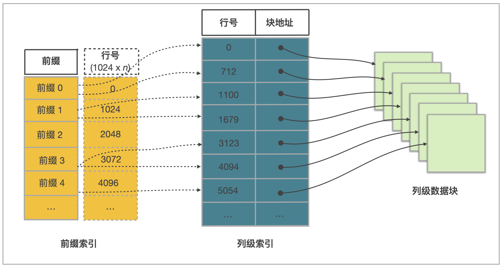

# StarRocks 知识整理

## 一、概述

StarRocks 是面向多种数据分析场景的极速 OLAP 分析引擎。

## 二、架构

| 模式   | 组件             |
|------|----------------|
| 存算一体 | FE + BE        |
| 存算分离 | FE + CN + HDFS |

**MPP 执行框架**：一条查询请求被拆分为多个逻辑执行单元，每个逻辑单元由多个物理执行单元并行实现。

---

## 三、表设计

### 3.1 分区

**作用：**

- 通过分区裁剪减少扫描量
- 仅元数据操作管理生命周期（TTL、GDPR 删除、分层存储）
- 控制写放大——新数据进入"热"分区，Compaction 发生在历史分区

**选择分区键：**

1. 时间优先——80% 查询含时间过滤器时，以 `date_trunc('day', dt)` 开始
2. 租户隔离——需按租户做数据管理时，将 `tenant_id` 纳入
3. 保留对齐——将计划清理的列纳入
4. 复合键：`PARTITION BY tenant_id, date_trunc('day', dt)` 可完美裁剪，但会创建 `#tenants × #days` 个分区，需保持总数 <
   100k

> 经验法则：每个分区 ≤ 100 GB，每个分区 ≤ 20k tablet（跨副本）。

---

### 3.2 分桶

**作用：** 将数据分布在多个 tablet 上，并行化查询执行并均衡负载。

**分区 vs 分桶对比：**

| 方面     | 分区                                     | 分桶（哈希/随机）                                            |
|--------|----------------------------------------|------------------------------------------------------|
| 主要目标   | 粗粒度裁剪和生命周期控制（TTL、归档）                   | 细粒度并行度和数据局部性                                         |
| 计划器可见性 | FE 可通过谓词跳过整个分区                         | 仅等值谓词支持分桶裁剪                                          |
| 生命周期操作 | DROP PARTITION 是仅元数据操作，适合 GDPR 删除、月度滚动 | 桶不能删除，只能通过 ALTER TABLE 修改                            |
| 典型数量   | 10²–10⁴（天、周、租户）                        | 每分区 10–120                                           |
| 倾斜处理   | 合并/拆分分区，考虑复合方案                         | 增加桶数、哈希复合键、随机分桶                                      |
| 警示信号   | > 100k 分区会给 FE 带来显著内存开销                | > 200k tablet/BE；单 tablet 超 10 GB 可能遇到 Compaction 问题 |

---

### 3.3 排序键

#### 存储层次对象

| 对象        | 定义                                     | 与排序键的关系                                     |
|-----------|----------------------------------------|---------------------------------------------|
| Partition | 表的粗粒度逻辑切片（如日期、tenant_id）               | 分区裁剪，隔离生命周期操作                               |
| Tablet    | 分区内的哈希/随机分桶，独立复制到 BE                   | 行在此单元按排序键物理有序                               |
| MemTable  | 内存写缓冲区（约 96 MB）                        | 刷盘前按声明键排序，保证落盘 Segment 已有序                  |
| Rowset    | 由刷新、流式导入或 Compaction 产生的不可变 Segment 集合 | 追加式设计，读写互不干扰                                |
| Segment   | Rowset 内部的自包含列式文件（约 512 MB），含数据页与裁剪索引  | Segment 级裁剪（Zone Map、短键索引）依赖 MemTable 阶段的顺序 |

#### 写入路径

```
MemTable（按排序键排序）
  → Segment 刷盘（有序）
  → Compaction（合并多 Rowset，无需重排）
  → 副本同步（BE 间保证有序一致）
```

分区键决定分区 → Hash 决定分桶 → 排序键决定顺序 → 主键重复键检查 → 写入存储

#### 读取路径

```
分区裁剪（WHERE 过滤分区键）
  → Tablet 裁剪（等值谓词 Hash 定位）
  → 短键索引定位（稀疏前缀索引，二分查找）
  → Zone Map 裁剪（Segment/页面级 min/max 元数据）
  → 向量化扫描 + 延迟物化
```

分区键决定分区 -> Hash 决定分桶 -> 排序键过滤 -> 并行读取 -> 返回结果

#### 选择排序键

**选择策略（顺序规则）：**

```
高选择性等值列 → 主要范围列 → 辅助聚簇列
```

**注意事项：**

- 控制在 3–5 列，前缀索引限制 36 字节
- 长字符串前导列会占满 36 字节，导致后续列无法被有效索引
- 低基数列放在高基数列之前有助于增强压缩
- 分桶负责均匀分布，排序负责高效 I/O 裁剪，两者用途不同

---

## 四、表类型

### 4.1 概览

| 表类型                | 唯一约束   | 重复数据行为            | 适用场景           |
|--------------------|--------|-------------------|----------------|
| 明细表（Duplicate Key） | 无      | 新旧数据共存            | 原始日志、时序数据      |
| 主键表（Primary Key）   | 主键唯一非空 | 新数据替代旧数据          | 实时更新、部分列更新     |
| 聚合表（Aggregate Key） | 聚合键唯一  | 按聚合函数合并           | 统计分析、预聚合       |
| 更新表（Unique Key）    | 唯一键唯一  | 新数据替代旧数据（REPLACE） | 实时更新（逐渐被主键表替代） |

---

### 4.2 主键表

**优势：** 支持实时数据更新的同时保证高效复杂即席查询性能。

**应用场景：**

- 实时对接事务型数据
- 部分列更新实现多流 JOIN

**注意事项：**

- 主键列必须定义在其他列之前
- 主键必须包含分区列和分桶列
- 主键列支持：数值（整型/布尔）、日期、字符串
- 单条主键值编码后最大长度 128 字节
- 建表后不支持修改主键，主键列值不能更新

**主键索引类型：**

1. 全内存主键索引
2. 基于本地磁盘的持久化主键索引
3. 云原生持久化主键索引

> 主键通常不加速查询，可用 ORDER BY 单独指定排序键加速查询。

---

### 4.3 明细表

**应用场景：** 原始日志、原始操作记录，查询灵活，数据只追加不更新。

**注意事项：**

- v3.3.0 起支持 ORDER BY 独立指定排序键；未指定时默认前三列
- v3.1.0 起支持随机分桶（默认）；之前仅支持哈希分桶
- v2.5.7 起支持自动设置分桶数量
- 所有列均可创建 Bitmap 索引、Bloom Filter 索引

---

### 4.4 聚合表

**应用场景：** 网站流量统计、广告点击量、电商交易汇总等聚合分析。

**聚合原理（三阶段）：**

1. 导入阶段：每批数据形成一个版本，相同聚合键数据聚合
2. Compaction 阶段：多版本文件合并时聚合相同聚合键数据
3. 查询阶段：返回结果前聚合所有版本中相同聚合键数据

**注意事项：**

- 聚合键必须定义在其他列之前，具有唯一约束
- v3.3.0 起排序键与聚合键解耦，可用 ORDER BY 单独指定
- 排序键列在多版本聚合之前过滤，建议将常用过滤列定义为排序键
- 只有 Key 列支持创建 Bitmap 索引、Bloom Filter 索引

---

### 4.5 更新表

**应用场景：** 实时频繁更新（如电商订单状态）。目前已逐渐被主键表替代。

**注意事项：**

- 唯一键必须定义在其他列之前，需显式用 UNIQUE KEY 定义
- v3.3.0 起排序键与唯一键解耦
- 只有 Key 列支持 Bitmap 索引、Bloom Filter 索引

---

## 五、索引

### 5.1 前缀索引（内置）

每写入 1024 行构成一个逻辑数据块，存储该块第一行数据的排序列前缀，查询时使用二分查找跳过不符合条件的数据。

**限制：**

- 前缀字段数量不超过 3 个
- 前缀索引项最大长度 36 字节
- CHAR/VARCHAR/STRING 类型列只能出现一次，且处于末尾位置

**建设建议：**

- 排序列一般 3 个，不超过 4 个
- 选择经常作为查询过滤条件的列
- 基数高的列优先考虑（裁剪效果更好）

---

### 5.2 Ordinal 索引（内置）

内置索引，按行号定位。

---

### 5.3 ZoneMap 索引（内置）

存储 Segment 及页面级 min/max 元数据，查询时通过谓词窗口裁剪不相关数据块。

---



### 5.4 Bitmap 索引

每一个 bit 对应表中一行，根据该行取值决定 bit 为 0 或 1。

**适用场景：** 较高基数列的查询，以及多个低基数列的组合查询。

**索引支持范围：**

- 主键表、明细表：所有列
- 聚合表、更新表：仅 Key 列

---

### 5.5 Bloom Filter 索引

快速判断数据文件中是否可能包含目标数据，适用于高基数列（如 ID 列）。

**特点：**

- 判断不存在：直接跳过文件（100% 准确）
- 判断可能存在：需读取文件确认（存在假阳性 / False Positive）

**索引支持范围：**

- 主键表、明细表：所有列
- 聚合表、更新表：仅 Key 列（维度列）

---

### 5.6 N-gram Bloom Filter 索引

Bloom Filter 索引的变体，先对字符串分词再写入 Bloom Filter，用于加速：

- `LIKE` 查询
- `ngram_search` / `ngram_search_case_insensitive` 函数

**限制：** 仅适用于 STRING、CHAR、VARCHAR 类型列。

**索引支持范围：**

- 主键表、明细表：所有字符串列
- 聚合表、更新表：仅键列（字符串类型）

---

### 5.7 全文倒排索引

将文本拆分为词，为每个词建立词→行号的映射，加速全文搜索。

**支持的谓词：**

- 启用分词（`parser = standard | english | chinese`）：`MATCH`、`MATCH_ANY`、`MATCH_ALL`
- 不分词（`parser = none`）：`(NOT) LIKE`、`(NOT) MATCH`、`(NOT) MATCH_ANY`、`(NOT) MATCH_ALL`（MATCH 语义等同于 LIKE）

**实现：**

- 存算一体：默认使用 CLucene
- 存算分离：默认使用 builtin（不支持 CLucene）

**限制：** 索引列数据类型必须是 CHAR、VARCHAR 或 STRING。

---

### 5.8 向量索引

将搜索项映射到 Segment 文件中的行 ID，无需暴力向量距离计算即可快速定位数据行。

#### IVFPQ（倒排文件与乘积量化）

| 组件   | 作用                              |
|------|---------------------------------|
| 倒排文件 | 将数据集划分为多个簇，搜索时只需搜索最近的簇，大幅减少搜索范围 |
| 乘积量化 | 将高维向量分割为子向量并量化，降低存储和计算成本        |

适用于大规模高维向量的近似最近邻搜索。

#### HNSW（分层可导航小世界）

基于图的高维最近邻搜索算法：

- 高层：少量顶点 + 稀疏连接，用于快速全局搜索
- 低层：全量顶点 + 密集连接，用于精确局部搜索

搜索时从顶层快速定位近似区域，逐层向下找到精确最近邻，兼顾效率与精度。

---
## 六、索引选择速查
| 场景 | 推荐索引 |
|-----|---------|
| 按前导列等值/范围查询 | 前缀索引（排序键设计） |
| 高基数列等值查询（如ID） | Bloom Filter 索引 |
| 多低基数列组合过滤 | Bitmap 索引 |
| 字符串 LIKE 模糊查询 | N-gram Bloom Filter 索引 |
|全文搜索 | 全文倒排索引 |
| 向量近似最近邻搜索 | IVFPQ / HNSW 向量索引 |
| Segment 数据块粗粒度裁剪 | ZoneMap索引（自动，无需创建） |